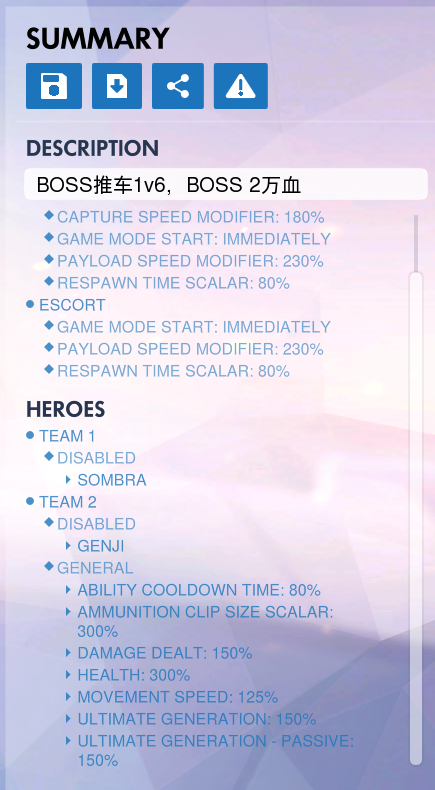

BOSS 1V6 推车模式

YGMD2

房主建房间，

队伍1 6名玩家，

队伍2 1名玩家为boss（放在位置0）再添加5个电脑占位置

BOSS初始1万血，如果推车到终点BOSS胜，如果击杀BOSS玩家胜利




```
rule("初始化参数")
{
	event
	{
		Ongoing - Global;
	}

	conditions
	{
		Is Game In Progress == True;
	}

	actions
	{
		Set Global Variable(A, Multiply(10000, 2));
		Set Global Variable(B, Players In Slot(0, Team 2));
		Create HUD Text(All Players(All Teams), String("{0} {1}", String("Remaining", Null, Null, Null), Global Variable(A), Null), Null,
			Null, Right, 0, White, White, White, Visible To and String);
		Set Status(Global Variable(B), Null, Unkillable, 9999);
		Set Status(Remove From Array(All Players(Team 2), Players In Slot(0, Team 2)), Null, Frozen, 9999);
		Set Player Variable(Global Variable(B), A, True);
		Create In-World Text(All Players(All Teams), Global Variable(A), Global Variable(B), 1.500, Clip Against Surfaces,
			Visible To Position and String);
		Set Player Variable(Global Variable(B), B, 50);
		Set Respawn Max Time(Global Variable(B), 0.500);
		Start Heal Over Time(Global Variable(B), Global Variable(B), 9999, 500);
	}
}

rule("受伤处理")
{
	event
	{
		Player took damage;
		All;
		All;
	}

	conditions
	{
		Player Variable(Event Player, A) == True;
	}

	actions
	{
		Modify Global Variable(A, Subtract, Event Damage);
	}
}

rule("吸血1")
{
	event
	{
		Player dealt damage;
		All;
		All;
	}

	conditions
	{
		Player Variable(Event Player, A) == True;
		Global Variable(A) < Multiply(1900, 10);
	}

	actions
	{
		Modify Global Variable(A, Add, Multiply(Event Damage, 0.500));
	}
}

rule("吸血2")
{
	event
	{
		Player dealt final blow;
		All;
		All;
	}

	conditions
	{
		Player Variable(Attacker, A) == True;
		Global Variable(A) < 3000;
	}

	actions
	{
		Modify Global Variable(A, Add, Multiply(1.200, Max Health(Victim)));
	}
}

rule("阵亡")
{
	event
	{
		Ongoing - Global;
	}

	conditions
	{
		Is Game In Progress == True;
		Global Variable(A) <= 0;
	}

	actions
	{
		Clear Status(Global Variable(B), Unkillable);
		Kill(Global Variable(B), Null);
		Wait(2, Ignore Condition);
		Declare Team Victory(Team 1);
	}
}
```
